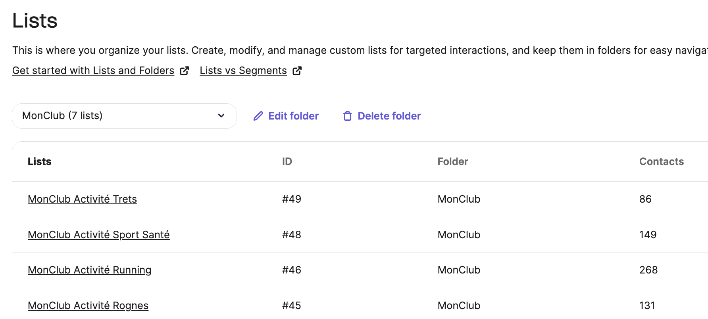
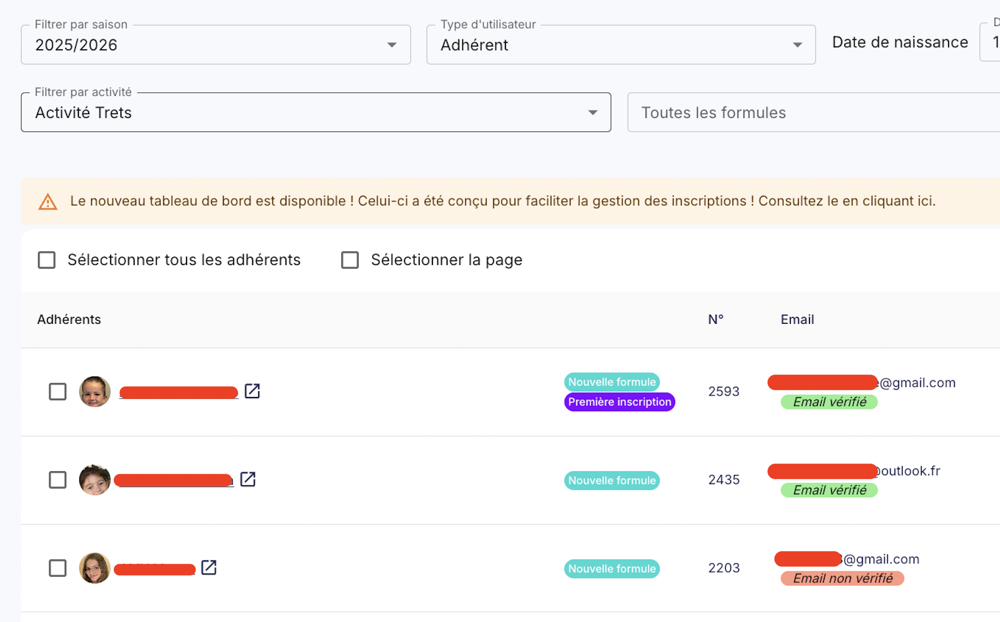
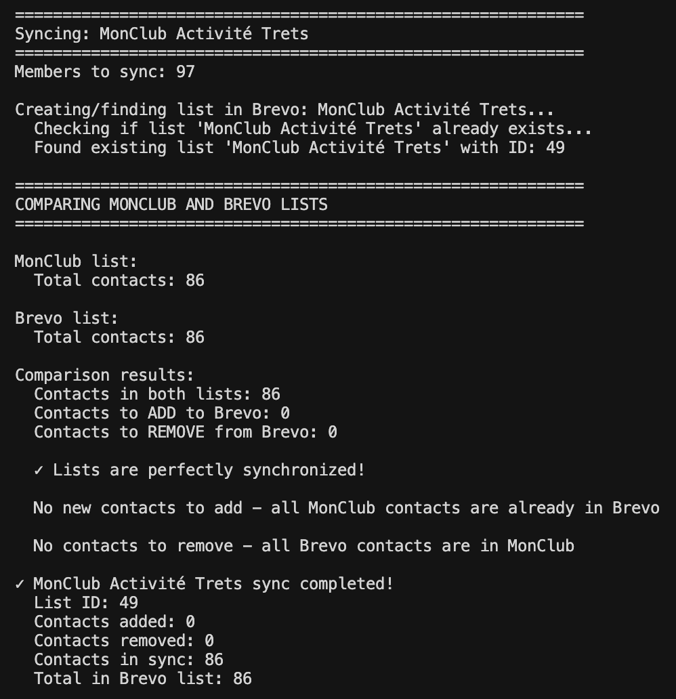

# MonClub to Brevo Sync

A Python script that synchronizes contact lists and members from MonClub API to Brevo (formerly Sendinblue) email marketing platform.

## Features

- 🔄 **Automatic Synchronization**: Syncs all MonClub lists to Brevo
- 📋 **List Management**: Creates lists in Brevo if they don't exist, or uses existing ones
- 👥 **Contact Management**: Adds new contacts, updates existing ones, and removes contacts no longer in MonClub
- 🔍 **Comparison**: Shows detailed comparison between MonClub and Brevo lists before syncing
- 📊 **Progress Tracking**: Displays progress indicators and detailed sync summaries
- 🛡️ **Error Handling**: Robust error handling with detailed error messages
- ⚙️ **Configurable**: All sensitive data stored in environment variables

## Requirements

- Python 3.7+
- Brevo API key
- MonClub API credentials
- Brevo account with a "MonClub" folder created

## Installation

1. Clone the repository:
```bash
git clone <repository-url>
cd monclub-brevo-sync
```

2. Create a virtual environment (recommended):
```bash
python3 -m venv venv
source venv/bin/activate  # On Windows: venv\Scripts\activate
```

3. Install dependencies:
```bash
pip install -r requirements.txt
```

## Configuration

Create a `.env` file in the project root with the following variables:

```env
# Brevo API Configuration
BREVO_API_KEY=your-brevo-api-key-here

# MonClub API Configuration
MONCLUB_BASE_URL=https://your-monclub-instance.monclub.app
MONCLUB_EMAIL=your-email@example.com
MONCLUB_PASSWORD=your-password
MONCLUB_CUSTOM_ID=your-custom-id
```

### Environment Variables

- `BREVO_API_KEY`: Your Brevo API key (get it from Brevo dashboard)
- `MONCLUB_BASE_URL`: Base URL of your MonClub instance (required, no fallback)
- `MONCLUB_EMAIL`: Email address for MonClub authentication
- `MONCLUB_PASSWORD`: Password for MonClub authentication
- `MONCLUB_CUSTOM_ID`: Custom ID for your MonClub organization

**Important**: The `.env` file is already in `.gitignore` to prevent committing sensitive data.

## Usage

Run the script:

```bash
python script.py
```

### Example Output

When the script runs successfully, you'll see output like this:

```
Syncing: MonClub Activité Trets
Members to sync: 97

Creating/finding list in Brevo: MonClub Activité Trets...
Found existing list 'MonClub Activité Trets' with ID: 49

COMPARING MONCLUB AND BREVO LISTS
MonClub list: Total contacts: 86
Brevo list: Total contacts: 86

Comparison results:
  Contacts in both lists: 86
  Contacts to ADD to Brevo: 0
  Contacts to REMOVE from Brevo: 0

✓ Lists are perfectly synchronized!

✓ MonClub Activité Trets sync completed!
  List ID: 49
  Contacts added: 0
  Contacts removed: 0
  Contacts in sync: 86
  Total in Brevo list: 86
```

The script will:

1. Authenticate to MonClub API
2. Fetch all lists from MonClub (only top-level lists where `parentId` is `null`)
3. Get members for each list
4. Authenticate to Brevo API
5. For each MonClub list:
   - Create or find the corresponding list in Brevo (in the "MonClub" folder)
   - Compare MonClub and Brevo lists
   - Add new contacts from MonClub
   - Remove contacts that are no longer in MonClub
   - Show detailed sync summary

### What Gets Synced

- **Lists**: Only MonClub lists with `parentId: null` (top-level lists)
- **Contacts**: Only contacts with email addresses
- **Contact Data**: Email, first name, and last name

### Skipped Lists

- Lists with 0 members are skipped (not created in Brevo)
- Sub-lists (where `parentId` is not `null`) are not processed

## How It Works

1. **Authentication**: 
   - Authenticates to MonClub API and retrieves an authentication token
   - Uses Brevo API key for Brevo authentication

2. **List Retrieval**:
   - Fetches all top-level lists from MonClub
   - Gets members for each list with their email, first name, and last name

3. **List Creation**:
   - Checks if list exists in Brevo before creating
   - Creates lists in the "MonClub" folder
   - Uses naming convention: "MonClub [Original List Name]"

4. **Contact Synchronization**:
   - Compares MonClub and Brevo lists to identify differences
   - Adds new contacts (batched in groups of 150 - Brevo API limit)
   - Updates existing contacts with latest information
   - Removes contacts from Brevo that are no longer in MonClub

5. **Batch Processing**:
   - Contacts are added/removed in batches of 150 to comply with Brevo API limits
   - Progress indicators show sync status

## Screenshots

> **Note**: Create a `screenshots/` directory in the project root and place the screenshot images there.

### MonClub Lists in Brevo

After running the sync, all MonClub lists are organized in the "MonClub" folder in Brevo:



*All synced lists are displayed with their contact counts and creation dates*

### MonClub Activity Filter

The script syncs lists based on MonClub activities. Here's an example of the activity filter in MonClub:



*MonClub interface showing available activities that can be synced*

### Sync Output Example

The script provides detailed console output showing the synchronization process:



*Example output showing successful synchronization with comparison results*

## Output

The script provides detailed output including:

- Authentication status
- List discovery and member counts
- Comparison results (contacts to add/remove)
- Progress indicators during contact processing
- Final sync summary for each list
- Overall summary of all synced lists

## Error Handling

The script includes comprehensive error handling:

- API authentication errors
- Network errors
- Missing environment variables
- Invalid API responses
- Individual contact processing errors (logged but don't stop the sync)

## Security Notes

- All sensitive credentials are stored in `.env` file (not committed to git)
- No hardcoded URLs or credentials in the source code
- `.env` file is in `.gitignore` to prevent accidental commits

## Troubleshooting

### "MONCLUB_BASE_URL environment variable is required"
- Make sure your `.env` file exists and contains `MONCLUB_BASE_URL`

### "MonClub folder not found"
- Create a folder named "MonClub" in your Brevo account before running the script

### "Error adding contacts to list: out_of_range"
- This should be handled automatically with batching, but if it occurs, the script processes contacts in batches of 150

### Contacts not syncing
- Check that contacts in MonClub have valid email addresses
- Verify API credentials are correct
- Check Brevo API rate limits

## Dependencies

- `brevo-python`: Brevo API client
- `python-dotenv`: Environment variable management
- `requests`: HTTP library for MonClub API calls

## License

[Add your license here]

## Contributing

[Add contribution guidelines if applicable]
